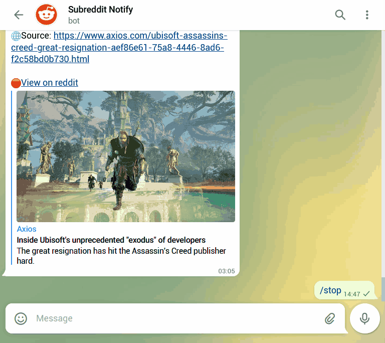

# 🔔Subreddit Notify

## Content

- [**📰Description**](#description)
- [**✨Features**](#features)
- [**🖼️Demo**](#demo)
  - [Getting subreddit updates](#getting-subreddit-updates)
  - [Validation while changing subreddit](#validation-while-changing-subreddit)
- [**🤖Bot commands**](#bot-commands)
- [**⏯️Steps**](#steps)
- [**👜Packages used**](#packages-used)
- [**⚙️How it works**](#how-it-works)
- [**✍️Author**](#author)
- [**🔒License**](#license)

<small><i><a href='http://ecotrust-canada.github.io/markdown-toc/'>Table of contents generated with markdown-toc</a></i></small>

## Description

A telegram bot which sends latest posts of subreddit of your choice. According to the set interval the bot will keep sending the latest updates from the subreddit, untill stopped.

## Features

- 🕐Get periodic updates Example: every 5 minutes.
- 💁Customizable subreddit and interval time.
- 🔥Unique new posts everytime.
- ⏮️If no new posts available, it sends an earlier post untill there are latest updates available.

## Demo

### Getting subreddit updates

### Validation while changing subreddit

## Bot commands

- /start - start getting updates
- /stop - stop getting updates
- /subreddit - Change the subreddit
- /help - show all commands

## Steps

- npm install: Install dependencies
- Create telegram bot using [botfather](https://www.siteguarding.com/en/how-to-get-telegram-bot-api-token), and save the API Key
- Create [.env file](https://www.freecodecamp.org/news/how-to-use-node-environment-variables-with-a-dotenv-file-for-node-js-and-npm/) in the root of project and set BOT_KEY to the bot API key recieved in previous step
- npm run dev: Run the server
- Start the telegram bot with /start command

## Packages used

- node-telegram-bot-api
- axios
- dotenv

## How it works

- Created a custom lighweight wrapper API for reddit containing simple methods to fetch posts, validate subreddit name and more.

- The posts fetched are processed to get the unique posts that havent been sent before.

- The posts are sent to the bot using the node-telegram-bot-api methods.

- According to commands given on bot, the server performs differnt tasks, like starting, stopping and changing the subreddit to fetch posts from.

## Author

Mayur Saroj (https://github.com/mayursarojdev)

## License

Subreddit-Notify

This program is free to use, modify and redistribute however give due credits to [@mayursarojdev](https://github.com/mayursarojdev).
